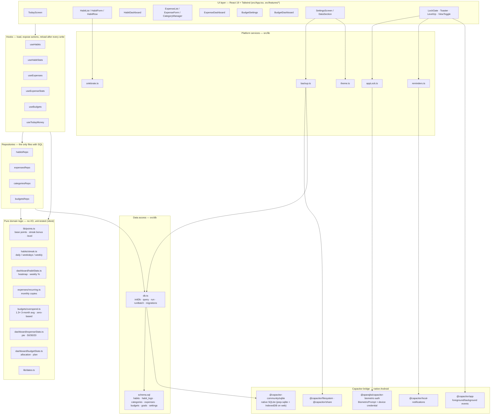
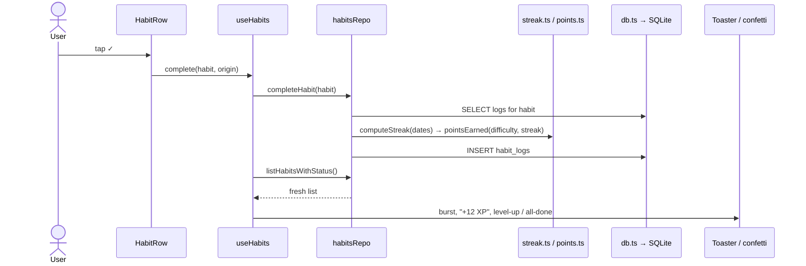

# HabEx — Architecture

Single-user, offline-first Android app. A React web app runs inside a Capacitor
WebView; all data lives in an on-device SQLite database. No backend.

## Layers



## Key rules

| Rule | Why |
|---|---|
| Components never touch SQL; hooks never touch SQL. Only `*Repo.ts` files do. | One place to change when the schema changes. |
| Every hook action is *write → reload*. | UI can never drift from the database. |
| Formulas and date maths are pure functions with tests. | Off-by-one errors in streaks/points would silently corrupt data. |
| Dates are local `YYYY-MM-DD` strings, never `toISOString()`. | UTC would shift late-evening completions to the next day. |
| `schema.sql` uses `IF NOT EXISTS`; later columns go through `runMigrations` in `db.ts`. | Safe to run on every launch, on old and new installs. |
| Colours are semantic tokens (`bg-surface`, `text-ink`) defined once in `index.css`. | Dark mode is a variable swap, not per-component work. |

## Data flow example — completing a habit



## Build & release

```
npm run dev          Vite dev server (web, IndexedDB-backed SQLite)
npm test             vitest — pure domain logic
npm run apk          debug APK   → android/app/build/outputs/apk/debug/
npm run apk:release  signed APK  → android/app/build/outputs/apk/release/
```

Signing reads `android/keystore.properties` (git-ignored). Bump `versionCode`
and `versionName` in `android/app/build.gradle` for every release.
